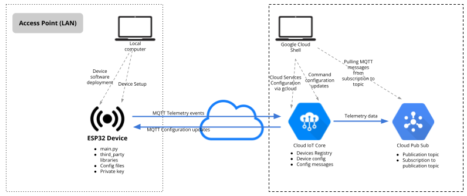

# Getting started with Cloud IoT Core and the ESP32 running MicroPython


This lab shows how to code and configure and end to end IoT example with Cloud IoT Core, ESP32 device, some basic electronic components and MicroPython. It is heavily based on [MicroPython Example with IoT Core](https://github.com/GoogleCloudPlatform/iot-core-micropython), that at the same time incorporate parts from [TrackingPrototype](https://github.com/jbrichau/TrackingPrototype).

## Bill of materials

- A development environment with direct USB access (your laptop)
- An ESP32-based development board
- Internet connectivity
- A data USB-A to micro USB cable to connect the dev board to your computer
- Access to a Google Cloud Platform project with Editor/Owner permissions
- A LED and a 330 Ohm resistor
- Sensirion's SHT3x I2C sensor dev board 

### On development boards

Some development boards have an onboard led that you can use for the purpose of this lab, but some others don't (as is the case of the ESP32 DevKitC1 used here). That's why you may need to connect an additional external LED to one of the GPIOs of your board to see when messages are being sent.

## Setting up the environment

Start by cloning this repo:

```bash
git clone https://gitlab.com/sw4iot/iot-esp32-iotcore
cd iot-esp32-iotcore
```

Create a virtual environment and install the tools required for the lab:

```bash
python3 -m venv venv
source venv/bin/activate
pip install -r requirements.txt
```

Make sure you have a working version of Micropython on your board. You can follow the steps in [IoT Devices Lab Series 2 - Flashing Micropython on the ESP32](https://docs.canadillas.org/iot/IoT_Devices_Lab_Series-2/) if you need to do so.

Source the `env.sh` file so we can connect to our board:

```bash
source env.sh
```

The configuration flow of the whole lab will be something like this:

<p align="center">

</p>

## Preparing the device configuration

### Hardware configuration

Connect a LED with the 330 Ohm resistor to one of the digital GPIOs of the ESP32 (let's say you use PIN32). Also, proceed to connect the SHT3x sensor to power and the ESP32 I2C pins [as described here](https://docs.canadillas.org/iot/IoT_Devices_Lab_Series-5/#esp32-i2c-pinout-and-physical-connections).

### Generating the public/private key pair

We need to generate a pair of keys to register the device in the Cloud IoT Core Device Registry and then be able to sign the JWT token for authentication. Do this in your local computer as you'll need to transfer your private key to device:

```bash
openssl genrsa -out rsa_private.pem 2048
openssl rsa -in rsa_private.pem -pubout -out rsa_public.pem
```

### Software configuration

Make a copy of the `config.py.example` file so you can edit it:

```bash
cp config.py.example config.py
```

Then, decode the private key using the included utility `decode_rsa.py` and append it to the  `config.py` file:

```bash
python utils/decode_rsa.py >> config.py
```

Now using a text editor edit the `config.py` file to place the key you appended to the file inside the `'private_key'` field of the **`jwt_config`** section (the key must go inside parenthesis). Then, set the different configuration sections required for the code to work:

- **`device_config`** will need to have the GPIO numbers where your LED and SHT3x sensor are connected
- **`wifi_config`** will need to have your Wireless LAN SSID and password. Remember that as the device will be connecting to the cloud, this WiFi needs to have Internet access.
- **`google_cloud_config`** section of the file based on the device and registry you set up in the previous step. You will also need to set the LED pin

You're now ready to copy the source MicroPython code and libraries from this repo to your device. For this, you can use Thonny or `ampy`, as we do in the example:

```bash
ampy put third_party
ampy put config.py
ampy put main.py
```

## Setting up Cloud IoT Core

Create an Cloud IoT Core Registry and register a new device [as described in the Cloud IoT Core documentation](https://cloud.google.com/iot/docs/how-tos/devices), using the keys from the previous step. For this, you'll need a GCP projec with the Cloud IoT Core and Pub/Sub services enabled and the proper permissions on them to perform the steps.

For the following commands, you can either use Google Cloud Shell in your GCP Project, or you cand install the Google Cloud SDK locally in your machine. Let's store some basic values in enviroment variables that the configuration commands will be using in this lab:

```bash
export CLOUD_PROJECT_ID="<your-gcp-project-id>"
export IOT_REGION="europe-west1"
export IOT_REGISTRY="sw4iotreg"
export IOT_PUBSUB_TOPIC="sw4iotpub"
export IOT_PUBSUB_TOPIC_SUB="sw4iotsub"
```

First, create a Pub/Sub topic where your device will be publishing data:

```bash
gcloud pubsub topics create "$IOT_PUBSUB_TOPIC"
```

Then, create a new registry with that topic associated to it:

```bash
gcloud iot registries create "$IOT_REGISTRY" \
    --project="$CLOUD_PROJECT_ID" \
    --region="$IOT_REGION" \
    --event-notification-config=topic="$IOT_PUBSUB_TOPIC"
```

Create a subscription to the topic so we can consume the messages sent by our device:

```bash
gcloud pubsub subscriptions create "$IOT_PUBSUB_TOPIC_SUB" \
    --topic="$IOT_PUBSUB_TOPIC"
```

Finally, create a new device. For this, you'll need to have the public key accessible from where you launch this command. If you're using Google Cloud Shell, remember to upload the public key file to Cloud Shell using the Cloud Shell menu option **Upload** accessible from the three dots menu in the upper right side of the Cloud Shell panel:

```bash
gcloud iot devices create esp32 \
    --region="$IOT_REGION" \
    --registry="$IOT_REGISTRY" \
    --public-key path=rsa_public.pem,type=rsa-pem
```

## Connecting to the device and launching the demo

Now, open a terminal in your computer and connect to the device over the serial port and press reset on the device. You can do this with Thonny or `minicom`, as in the following example:

```bash
minicom
```

If everything worked you should see output similar to the following.

```text
Publishing message {“temp”: 113, “device_id”: “esp32”}
Publishing message {“temp”: 114, “device_id”: “esp32”}
Publishing message {“temp”: 114, “device_id”: “esp32”}
```

You can read the telemetry from PubSub using the following [Google Cloud SDK](https://cloud.google.com/sdk) command:

```bash
gcloud pubsub subscriptions pull sw4iotsub --auto-ack --limit=500
```

or going to the [Google Cloud Console](https://console.cloud.google.com/iot/registries) and navigating to the subscription of the topic registered to your registry.

## Exercises

### Integrating the SHT3x sensor data

The SHT3x library is included in the `third_party` directory. Let's try to send data from this sensor to the Cloud following the next steps:

1. Import the library into your code
1. Initialize the communication bus (you may have a look at the sample code we used in our labs in previous classes to see how to do this)
2. Initialize the sensor instantiating the sensor class and passing the bus you initialized in the previous step
3. Call the proper method of the sensor object to get temperature and data, using clock stretching
4. Modify the MQTT message to send both temperature and data to Cloud IoT Core

### Sending commands to the device

Our code is prepared to process MQTT commands sent to the device. Try it out by sending the following command:

``` bash
gcloud iot devices commands send --command-data="{command: 'Hello from IoT Core'}" --device=esp32 --registry=$IOT_REGISTRY --region=$IOT_REGION
```

Try now modifying the code so each time you send a command "UPDATE" the led turns on for 5 seconds.

## See Also
- [Connecting MicroPython devices to Cloud IoT Core](https://medium.com/google-cloud/connecting-micropython-devices-to-google-cloud-iot-core-3680e632681e)
- Some small modifications have been done to [python-rsa](https://github.com/sybrenstuvel/python-rsa) library to allow this to work on MicroPython.

## License
Apache 2.0; see [LICENSE](LICENSE) for details.